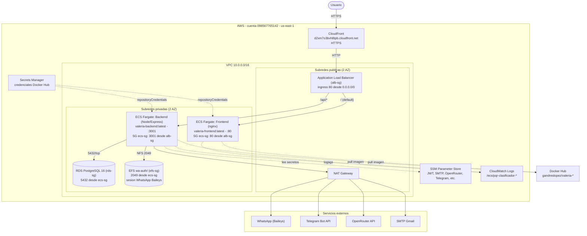

# Diagrama de Arquitectura AWS — pqr-clasificador (ValerIA)

Diagrama Mermaid generado a partir de la infraestructura definida en `Terraform/`.
Cuenta AWS `098567765142`, región `us-east-1`.

## Recursos clave (Terraform)

| Componente | Recurso Terraform | Notas |
|---|---|---|
| CDN | `aws_cloudfront_distribution.frontend` | Origin = ALB, `/api/*` sin cache |
| Load Balancer | `aws_lb.main` | Listener HTTP :80 |
| Target groups | `aws_lb_target_group.backend` / `.frontend` | health check `/` → 200 |
| Cluster ECS | `aws_ecs_cluster.main` | Fargate |
| Servicio backend | `aws_ecs_service.backend` | task family `pqr-clasificador-backend`, puerto 3001 |
| Servicio frontend | `aws_ecs_service.frontend` | task family `pqr-clasificador-frontend`, puerto 80 |
| Base de datos | `aws_db_instance.main` | PostgreSQL 16, privada |
| Persistencia WhatsApp | `aws_efs_file_system.wa_auth` | montado en `/app/wa-auth` del backend |
| Secretos app | `Terraform/ssm.tf` | SSM Parameter Store (SecureString) |
| Credenciales Docker Hub | `Terraform/dockerhub.tf` | Secrets Manager + `repositoryCredentials` |
| Logs | `aws_cloudwatch_log_group.backend` / `.frontend` | `/ecs/pqr-clasificador-*` |
