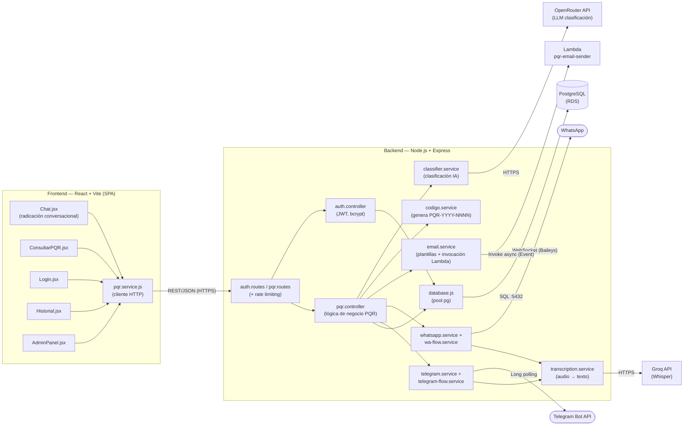
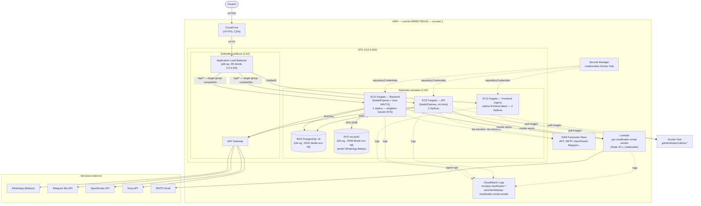

# ValerIA — Sistema Inteligente de Gestión de PQR con IA

## Estudiantes que conforman el grupo

> _(Completar — nombre completo de cada integrante)_
> - Estudiante 1
> - Estudiante 2
> - Estudiante 3

> _(Completar — datos de la institución)_
> - **Universidad / Institución:**
> - **Programa académico:**
> - **Asignatura:**

**Evaluación RAP — Momento 3**

---

## 1. Identificación y formulación del problema

### Problema

Las instituciones educativas reciben constantemente Peticiones, Quejas y Reclamos (PQR) de estudiantes, padres y administrativos por canales dispersos (formularios físicos, correo, llamadas, oficinas de atención). La clasificación, priorización y asignación de cada caso al área responsable se hace de forma **manual**, lo que genera demoras, pérdida de trazabilidad y respuestas inconsistentes.

### Causas

- Triage manual: una persona debe leer cada PQR para determinar tipo, categoría, prioridad y área responsable.
- Canales de radicación desconectados entre sí (presencial, correo, redes sociales) sin un repositorio único.
- Ausencia de un código de seguimiento único que el usuario pueda consultar por su cuenta.
- No existen criterios objetivos de priorización (un caso "urgente" puede quedar en la misma cola que una consulta general).
- No hay generación automática de una respuesta inicial ni plantillas institucionales estandarizadas.
- Falta de métricas históricas (volumen, categorías más frecuentes, tiempos de respuesta) para la toma de decisiones.

### Consecuencias

- Incumplimiento de tiempos de respuesta, especialmente en casos urgentes (matrícula, acoso, bloqueos académicos).
- Sobrecarga del personal administrativo dedicado a clasificar y redactar respuestas repetitivas.
- Insatisfacción del usuario por falta de visibilidad del estado de su solicitud.
- Pérdida de información histórica útil para auditorías y mejora continua institucional.

### Área de aplicación

Instituciones educativas (colegios, institutos y universidades) en Colombia, específicamente las áreas de **Coordinación académica, Tesorería, Registro y control, Bienestar/Convivencia, Soporte TI y Dirección**, que son las áreas responsables a las que el sistema enruta cada PQR según su clasificación.

---

## 2. Descripción de la solución

**¿Qué es?**
ValerIA es una plataforma web (con bots de WhatsApp y Telegram integrados) que permite a cualquier usuario radicar una PQR redactando su caso en lenguaje natural — por texto o por **nota de voz** —, y que utiliza un modelo de Inteligencia Artificial (vía OpenRouter) para clasificarlo automáticamente por **tipo, categoría, prioridad, sentimiento y área responsable**, generar un **código de seguimiento único** y un **borrador de respuesta institucional**.

**¿Por qué?**
Porque el proceso manual actual es lento, inconsistente entre operadores y no escala con el volumen de solicitudes, mientras que un modelo de lenguaje puede clasificar y redactar una primera respuesta en segundos con un costo marginal (< US$0.001 por clasificación con modelos gratuitos de OpenRouter).

**¿Para qué?**
- Reducir el tiempo de primera respuesta al usuario.
- Dar trazabilidad y autoservicio (consulta por código o por cédula, sin necesidad de cuenta).
- Liberar al personal administrativo del triage manual, dejándolo enfocado en revisar/aprobar la respuesta sugerida por la IA.
- Brindar a la dirección un panel de estadísticas (por categoría, prioridad, estado y evolución diaria) para la toma de decisiones.

**Alcance**

- Aplicación web (React) con landing/chat de radicación, consulta pública por código/cédula, historial de usuario autenticado y panel de administración.
- Bot de **WhatsApp** (Baileys) y bot de **Telegram**, ambos con flujo conversacional equivalente al de la web (incluye transcripción de audio con Groq/Whisper).
- Backend Node.js/Express con autenticación JWT, clasificación por IA, generación de código de radicado y notificaciones (email, WhatsApp, Telegram) ante cambios de estado o respuesta disponible.
- Persistencia en PostgreSQL (RDS) y sesión de WhatsApp persistente en EFS.
- Despliegue en AWS con alta disponibilidad (múltiples réplicas detrás de un Load Balancer + CloudFront) e infraestructura como código (Terraform).
- Envío de correos desacoplado mediante una función AWS Lambda invocada de forma asíncrona.

**Factor diferenciador**

- **Multicanal real**: el mismo flujo conversacional (texto o audio) funciona en Web, WhatsApp y Telegram, con un backend único.
- **Clasificación + respuesta sugerida por IA**, con flujo de aprobación humana (el administrador puede aprobar o editar antes de enviar al usuario).
- **Autoservicio sin fricción**: un ciudadano puede consultar el estado de su caso solo con su código o cédula, sin crear cuenta.
- **Arquitectura cloud-native con alta disponibilidad y desacoplamiento de responsabilidades** (servicio API separado de los bots, envío de correos vía Lambda), diseñada siguiendo el framework AWS Well-Architected.

---

## 3. Requerimientos funcionales y no funcionales

### Historias de usuario

| # | Historia de usuario |
|---|---|
| HU-01 | Como **ciudadano**, quiero radicar una PQR escribiendo mi caso en el chat web, para recibir un código de seguimiento sin necesidad de registrarme. |
| HU-02 | Como **usuario de WhatsApp**, quiero escribir "Hola, vengo a dejar una PQR" y que el bot me guíe pidiéndome nombre, cédula y correo, para radicar mi caso desde mi celular. |
| HU-03 | Como **usuario de WhatsApp/Telegram**, quiero poder enviar una **nota de voz** describiendo mi caso, para no tener que escribir un texto largo. |
| HU-04 | Como **ciudadano**, quiero consultar el estado de mi PQR ingresando mi **código de radicado** (`PQR-2026-0000`), para saber en qué va mi solicitud. |
| HU-05 | Como **ciudadano**, quiero consultar **todos mis casos** ingresando mi número de cédula, para verlos sin recordar cada código. |
| HU-06 | Como **usuario registrado**, quiero iniciar sesión y ver mi **historial de PQR**, para llevar seguimiento organizado de todas mis solicitudes. |
| HU-07 | Como **usuario**, quiero recibir un **correo de confirmación** al radicar mi PQR con mi código, tipo, categoría, prioridad y área responsable, para tener constancia. |
| HU-08 | Como **usuario**, quiero recibir una **notificación (correo, WhatsApp o Telegram)** cada vez que cambie el estado de mi PQR (Recibida → En proceso → Cerrada), para estar informado sin tener que consultar manualmente. |
| HU-09 | Como **usuario**, quiero recibir la **respuesta institucional** una vez esté disponible y aprobada, por el mismo canal donde radiqué (correo, WhatsApp o Telegram). |
| HU-10 | Como **administrador**, quiero ver un **panel de estadísticas** (totales, por estado, categoría, prioridad y evolución de los últimos 30 días), para entender la carga y prioridades del área. |
| HU-11 | Como **administrador**, quiero **listar y filtrar** todas las PQR por estado, categoría y prioridad con paginación, para gestionar mi cola de trabajo. |
| HU-12 | Como **administrador**, quiero **cambiar el estado** de una PQR, para reflejar el avance real del trámite. |
| HU-13 | Como **administrador**, quiero **revisar, editar o aprobar** la respuesta institucional generada por la IA antes de que se envíe al usuario, para garantizar calidad y tono institucional. |
| HU-14 | Como **usuario nuevo**, quiero poder **registrarme e iniciar sesión** con correo y contraseña, para acceder a funciones personalizadas (historial). |
| HU-15 | Como **usuario de WhatsApp**, quiero usar comandos rápidos como `CONSULTAR PQR-2026-0000`, `nuevo caso` o `reiniciar`, para controlar el flujo conversacional sin fricción. |

### Requerimientos funcionales

| # | Requerimiento | Descripción |
|---|---|---|
| RF-01 | Radicación multicanal | El sistema debe permitir la radicación de una PQR desde la aplicación web, WhatsApp y Telegram, aceptando entrada por texto o por nota de voz. |
| RF-02 | Clasificación automática con IA | El sistema debe clasificar cada PQR mediante un modelo de lenguaje (OpenRouter), asignando tipo, categoría, prioridad, sentimiento y área responsable de forma automática. |
| RF-03 | Generación de código de seguimiento | El sistema debe generar un código único con formato `PQR-AAAA-NNNN` para cada PQR radicada y asociarlo de forma persistente al caso. |
| RF-04 | Transcripción de audio a texto | El sistema debe convertir notas de voz recibidas por WhatsApp o Telegram a texto mediante un servicio de transcripción (Groq/Whisper) antes de clasificarlas. |
| RF-05 | Consulta pública de estado | El sistema debe permitir consultar el estado de una o varias PQR mediante el código de radicado o el número de cédula, sin requerir autenticación. |
| RF-06 | Generación de respuesta institucional sugerida | El sistema debe generar automáticamente un borrador de respuesta institucional para cada PQR, basado en su contenido y clasificación. |
| RF-07 | Notificaciones automáticas multicanal | El sistema debe notificar al usuario por correo electrónico, WhatsApp o Telegram (según el canal de origen) ante la radicación, el cambio de estado y la disponibilidad de la respuesta institucional. |
| RF-08 | Gestión de usuarios y autenticación | El sistema debe permitir el registro e inicio de sesión de usuarios mediante correo y contraseña, con manejo de roles (usuario/administrador) basado en JWT. |
| RF-09 | Administración y gestión de casos | El sistema debe proveer un panel administrativo para listar, filtrar y paginar las PQR, cambiar su estado y revisar/editar/aprobar la respuesta sugerida por la IA. |
| RF-10 | Panel de estadísticas | El sistema debe generar estadísticas agregadas (totales, distribución por estado/categoría/prioridad y evolución diaria) para apoyar la toma de decisiones administrativas. |

### Requerimientos no funcionales

| # | Requerimiento | Descripción |
|---|---|---|
| RNF-01 | **Alta disponibilidad** | Los servicios sin estado (frontend y API) corren con **múltiples réplicas** en ECS Fargate distribuidas en distintas zonas de disponibilidad, detrás de un Application Load Balancer. |
| RNF-02 | **Despliegues sin downtime** | `deployment_minimum_healthy_percent = 50` / `maximum_percent = 200` permite actualizar versiones de forma incremental (rolling update) sin caídas de servicio. |
| RNF-03 | **Seguridad** | Autenticación JWT (expiración 8h), contraseñas con `bcrypt`, *rate limiting* en radicación (10 solicitudes / 15 min), credenciales y secretos en SSM Parameter Store / Secrets Manager (nunca en código), subredes privadas para backend y base de datos. |
| RNF-04 | **Bajo costo / eficiencia** | Cómputo serverless con Fargate, RDS `db.t4g.micro`, modelos de IA gratuitos (`:free` de OpenRouter) y Lambda con facturación por invocación. |
| RNF-05 | **Persistencia confiable** | PostgreSQL en RDS para datos transaccionales; EFS para conservar la sesión autenticada de WhatsApp (Baileys) entre despliegues. |
| RNF-06 | **Observabilidad** | Logs centralizados en CloudWatch por servicio (`/ecs/pqr-clasificador-backend`, `-api`, `-frontend`, `/aws/lambda/pqr-clasificador-email-sender`) con retención de 14 días. |
| RNF-07 | **Desacoplamiento / mantenibilidad** | El envío de correos se delega a una función Lambda independiente, separando responsabilidades del backend y permitiendo escalarlo o reemplazarlo sin tocar la API. |
| RNF-08 | **Usabilidad** | Interfaz responsive con modo claro/oscuro persistente, accesible desde web y desde apps de mensajería ya instaladas por el usuario (WhatsApp/Telegram). |
| RNF-09 | **Infraestructura como código** | Toda la infraestructura AWS está definida y versionada en Terraform, permitiendo reproducir el entorno y revisar cambios mediante `plan`/`apply`. |

---

## 4. Vista arquitectónica e interpretación detallada de la solución

### Arquitectura de la aplicación — vista de componentes y conectores

### Interpretación

- **Frontend (React/Vite)** consume exclusivamente la API REST del backend a través de `pqr.service.js`. No tiene lógica de negocio: páginas para radicar (`Chat.jsx`), consultar (`ConsultarPQR.jsx`), ver historial (`Historial.jsx`), autenticarse (`Login.jsx`) y administrar (`AdminPanel.jsx`).
- **Backend (Express)** expone los endpoints `/api/auth/*` y `/api/pqr/*`. El `pqr.controller` orquesta: clasificación con IA, generación del código de radicado, persistencia en PostgreSQL y disparo (fire-and-forget) de notificaciones por correo, WhatsApp y Telegram.
- **classifier.service** envía el texto de la PQR a OpenRouter (modelo `openrouter/auto`) y recibe un JSON estructurado con `tipo`, `categoria`, `prioridad`, `sentimiento`, `area_responsable`, `resumen`, `respuesta` sugerida y `confianza`.
- **transcription.service** convierte notas de voz recibidas por WhatsApp/Telegram a texto usando Groq (Whisper) antes de enviarlas al clasificador.
- **whatsapp.service / telegram.service** mantienen el estado conversacional por número de teléfono o `chat_id` (tablas `conversaciones_wa` / `conversaciones_tg`) y notifican cambios de estado/respuesta a los usuarios por su canal de origen.
- **email.service** ya **no usa SMTP directamente**: arma el HTML de la plantilla y lo envía como *payload* (`{to, subject, html}`) a la función Lambda `pqr-clasificador-email-sender` mediante `InvocationType: "Event"` (asíncrono, no bloquea la respuesta HTTP).
- **database.js** expone una interfaz `prepare().get/all/run()` compatible con `better-sqlite3` mientras internamente usa un *pool* de `pg` contra PostgreSQL (RDS), traduciendo placeholders `?` → `$1, $2, ...`.

---

## 5. Vista de despliegue AWS

### Descripción e interpretación de la vista de despliegue

| Componente | Recurso Terraform | Rol |
|---|---|---|
| CDN | `aws_cloudfront_distribution.frontend` | Punto de entrada HTTPS para el usuario; origin = ALB, sin caché en `/api/*`. |
| Load Balancer | `aws_lb.main` + `aws_lb_listener.http` | Enruta `/` → frontend y `/api/*` → grupo de destino compartido por `backend` y `api`. |
| Target group backend | `aws_lb_target_group.backend` | Compartido por **2 servicios ECS** (backend + api) → 3 destinos saludables en total (1 + 2). |
| Cluster ECS | `aws_ecs_cluster.main` | Cluster Fargate que aloja los 3 servicios. |
| Servicio `backend` | `aws_ecs_service.backend` (1 réplica) | Único que ejecuta los **bots de WhatsApp y Telegram** (restricción de singleton: sesión Baileys en EFS y *long polling* de Telegram no soportan múltiples réplicas). También sirve `/api/*`. |
| Servicio `api` (nuevo) | `aws_ecs_service.api` (2 réplicas) | API REST sin bots (`WHATSAPP_ENABLED=false`, `TELEGRAM_ENABLED=false`), comparte el target group del backend → da **alta disponibilidad** a la API sin duplicar los bots. |
| Servicio `frontend` | `aws_ecs_service.frontend` (2 réplicas) | Sirve el SPA compilado (nginx) detrás del ALB/CloudFront. |
| Base de datos | `aws_db_instance.main` | PostgreSQL 16 en subred privada, accesible solo desde `ecs-sg`. |
| Persistencia WhatsApp | `aws_efs_file_system.wa_auth` + access point | Monta `/app/wa-auth` solo en el servicio `backend`. |
| Envío de correos | `aws_lambda_function.email_sender` (`lambda.tf`) | Función Node 20.x invocada de forma **asíncrona** desde `backend` y `api` (`lambda:InvokeFunction`, IAM en `iam.tf`); reutiliza credenciales SMTP de Gmail vía variables de entorno. |
| Secretos app | `Terraform/ssm.tf` | SSM Parameter Store (`SecureString`) para JWT, SMTP, OpenRouter, Telegram, etc. |
| Credenciales Docker Hub | `Terraform/dockerhub.tf` | Secrets Manager + `repositoryCredentials` en las 3 task definitions (evita *rate limit* 429 en pulls anónimos). |
| Logs | `aws_cloudwatch_log_group.*` | Un log group por servicio + uno para la Lambda, retención 14 días. |

### Alineación con los 6 pilares de AWS Well-Architected

| Pilar | Cómo se aplica en ValerIA |
|---|---|
| **Excelencia operativa** | Infraestructura 100% como código (Terraform), despliegues *rolling* sin downtime (`deployment_minimum_healthy_percent`/`maximum_percent`), logs centralizados en CloudWatch por servicio para diagnóstico rápido. |
| **Seguridad** | Subredes privadas para backend, API, RDS y EFS; *Security Groups* con acceso mínimo necesario (ALB → ECS → RDS/EFS); secretos en SSM Parameter Store / Secrets Manager (nunca hardcodeados); IAM con roles separados (`ecs_execution`, `ecs_task`, `lambda_email_sender`) y permisos de mínimo privilegio (p. ej. el rol de la Lambda solo tiene `AWSLambdaBasicExecutionRole`); autenticación JWT + `bcrypt` y *rate limiting* a nivel de aplicación. |
| **Fiabilidad (reliability)** | VPC con subredes en **2 zonas de disponibilidad**; ALB con *health checks* sobre `/`; servicios `frontend` y `api` con **2 réplicas** cada uno y despliegue incremental; sesión de WhatsApp persistida en EFS para sobrevivir a redeploys del servicio `backend`. |
| **Eficiencia de rendimiento** | Cómputo *serverless* (Fargate) dimensionado por servicio (`backend`/`api`: 512 CPU / 1024 MB; `frontend`: 256 CPU / 512 MB); CDN (CloudFront) reduce latencia de assets estáticos; Lambda dimensionada para una tarea corta (timeout 10 s). |
| **Optimización de costos** | RDS `db.t4g.micro` (Free Tier), backups deshabilitables (`db_backup_retention_period`), modelos de IA gratuitos (`:free` de OpenRouter), Lambda con cobro por invocación (sin servidor *idle*) y NAT Gateway compartido por todos los servicios privados. |
| **Sostenibilidad** | Uso de servicios *serverless*/administrados (Fargate, Lambda, RDS) que permiten apagar/ajustar recursos según demanda en lugar de mantener servidores dedicados encendidos permanentemente; separar la API en un servicio independiente permite escalar solo esa parte cuando aumenta la demanda, sin sobreaprovisionar el servicio que ejecuta los bots. |

---

## 6. Despliegue de la solución

### Estructura de archivos de Terraform (`Terraform/`)

| Archivo | Contenido |
|---|---|
| `versions.tf` | Proveedores requeridos (`hashicorp/aws ~> 5.0`, `hashicorp/archive ~> 2.4`) y configuración del backend de estado. |
| `variables.tf` | Variables de entrada (región, nombre del proyecto, credenciales de BD, claves de API, flags de canales, repositorios de imágenes, etc.). |
| `vpc.tf` | VPC, subredes públicas/privadas en 2 AZ, NAT Gateway, tablas de rutas. |
| `security_groups.tf` | Grupos de seguridad: `alb-sg`, `ecs-sg`, `rds-sg`, `efs-sg`. |
| `alb.tf` | Application Load Balancer, listener HTTP y *target groups* (`backend`, `frontend`). |
| `cloudfront.tf` | Distribución CDN con el ALB como origin. |
| `rds.tf` | Instancia RDS PostgreSQL 16 en subred privada. |
| `efs.tf` | Sistema de archivos EFS y *access point* para la sesión de WhatsApp. |
| `ecs.tf` | Cluster ECS y *task definitions* / servicios `backend`, `api` y `frontend`. |
| `iam.tf` | Roles y políticas IAM (ejecución ECS, rol de tarea, acceso a SSM/Secrets/EFS, invocación de la Lambda de correo). |
| `ssm.tf` | Parámetros `SecureString` con secretos de la aplicación. |
| `dockerhub.tf` | Secreto en Secrets Manager con credenciales de Docker Hub. |
| `lambda.tf` | Empaquetado (`archive_file`) y definición de la función `pqr-clasificador-email-sender`, su rol IAM y log group. |
| `lambda/email-sender/` | Código fuente de la Lambda (`index.js`, `package.json`, `node_modules/nodemailer`). |
| `outputs.tf` | Salidas: DNS del ALB, dominio de CloudFront, endpoint de RDS, nombre del cluster/servicio. |

### Control de versiones en Git

- Repositorio Git en la raíz del proyecto (`ValerIA/`), rama principal `main`.
- Historial actual: commits `Primer commit` → `ultimo commit`, que incluyen el código de la aplicación (`backend/`, `frontend/`) y la infraestructura (`Terraform/`).
- Buenas prácticas aplicadas/recomendadas:
  - Archivos sensibles (`.env`, `database.db`, `wa-auth/`, `*.tfstate`, `tfplan`) excluidos vía `.gitignore`.
  - Cambios de infraestructura validados con `terraform plan` (guardado en `tfplan`) antes de `terraform apply`.
  - Cambios de la aplicación empaquetados como imágenes Docker versionadas y publicadas en Docker Hub (`gandreslopez/valeria-backend`, `gandreslopez/valeria-frontend`), referenciadas desde `variables.tf` (`backend_image_tag`, `frontend_image_tag`).

---

## 7. Presentación de la solución

### Funcionamiento de la aplicación

1. **Radicación**: el usuario describe su caso por web (`/chat`), WhatsApp o Telegram, en texto o audio (transcrito con Groq/Whisper).
2. **Clasificación con IA**: `classifier.service` envía el texto a OpenRouter y obtiene tipo, categoría, prioridad, sentimiento, área responsable, resumen, confianza y un borrador de respuesta institucional.
3. **Registro**: se genera un código único `PQR-AAAA-NNNN`, se guarda en PostgreSQL y se responde de inmediato al usuario con su código.
4. **Notificación**: de forma asíncrona (*fire-and-forget*), se invoca la Lambda de correo para enviar la confirmación, sin bloquear la respuesta HTTP.
5. **Seguimiento**: el usuario consulta el estado en `/consultar` (por código o cédula) o desde el bot (`CONSULTAR PQR-2026-0000`).
6. **Gestión administrativa**: en `/admin`, el equipo institucional revisa estadísticas, filtra casos, cambia el estado (Recibida → En proceso → Cerrada) y aprueba/edita la respuesta sugerida por la IA antes de enviarla.
7. **Cierre**: al aprobar la respuesta o cambiar el estado, el sistema notifica automáticamente al usuario por correo (vía Lambda), WhatsApp y/o Telegram, según el canal de origen.

### Servicios desplegados en la nube (AWS)

- **Amazon ECS (Fargate)**: 3 servicios — `backend` (API + bots, 1 réplica), `api` (API sin bots, 2 réplicas) y `frontend` (SPA en nginx, 2 réplicas).
- **Application Load Balancer + CloudFront**: balanceo y entrega HTTPS del tráfico web y de la API.
- **Amazon RDS (PostgreSQL 16)**: base de datos relacional para PQR, usuarios y conversaciones.
- **Amazon EFS**: persistencia de la sesión de WhatsApp (Baileys) entre despliegues.
- **AWS Lambda**: función dedicada al envío de correos transaccionales (desacoplada del backend).
- **SSM Parameter Store / Secrets Manager**: gestión centralizada de secretos (BD, JWT, SMTP, IA, Telegram, Docker Hub).
- **CloudWatch Logs**: observabilidad de los 3 servicios ECS y de la Lambda.

### Alta disponibilidad, escalamiento y elasticidad

- **Alta disponibilidad**: los componentes sin estado (`frontend` y `api`) corren con **2 réplicas** cada uno, repartidas en **2 zonas de disponibilidad** detrás del ALB; si una tarea falla, ECS la reemplaza automáticamente y el ALB deja de enrutarle tráfico (*health checks*).
- **Separación de responsabilidades para HA**: dado que los bots de WhatsApp/Telegram requieren una única instancia (sesión EFS y *long polling*), se aisló esa restricción en el servicio `backend` (1 réplica), mientras que toda la **API REST** queda disponible en alta disponibilidad a través del nuevo servicio `api` (2 réplicas), que comparte el mismo *target group*.
- **Despliegues sin interrupciones**: `deployment_minimum_healthy_percent = 50` y `deployment_maximum_percent = 200` permiten reemplazar tareas de forma incremental durante una actualización.
- **Elasticidad**: al usar **Fargate**, cada tarea consume solo los recursos de CPU/memoria definidos por servicio (256/512 para frontend, 512/1024 para backend y api) sin gestionar servidores; el `desired_count` de cada servicio puede ajustarse (manual o vía *Application Auto Scaling*) según la demanda.

### Seguridad

- Subredes privadas para backend, API, base de datos y EFS; solo el ALB es accesible desde internet.
- *Security Groups* en cadena: `alb-sg` → `ecs-sg` → `rds-sg` / `efs-sg`, cada uno permitiendo solo el puerto necesario desde el grupo anterior.
- Autenticación con JWT (8h de expiración) y contraseñas con `bcrypt`; *rate limiting* en el endpoint de radicación.
- Secretos (credenciales de BD, JWT, SMTP, API keys, token de Telegram, credenciales de Docker Hub) gestionados en SSM Parameter Store y Secrets Manager, inyectados como `secrets` en las *task definitions* (nunca en la imagen ni en el repositorio).
- Roles IAM de mínimo privilegio: el rol de tarea de ECS solo puede acceder al *access point* específico de EFS y a invocar la función Lambda de correo; el rol de la Lambda solo tiene permisos básicos de logging.

### Observabilidad

- Cada servicio ECS (`backend`, `api`, `frontend`) y la Lambda de correo escriben sus logs en grupos dedicados de **CloudWatch Logs** (`/ecs/pqr-clasificador-*`, `/aws/lambda/pqr-clasificador-email-sender`) con 14 días de retención, lo que permite auditar clasificaciones, errores de integración (IA, WhatsApp, Telegram, Lambda) y el estado de los despliegues.
